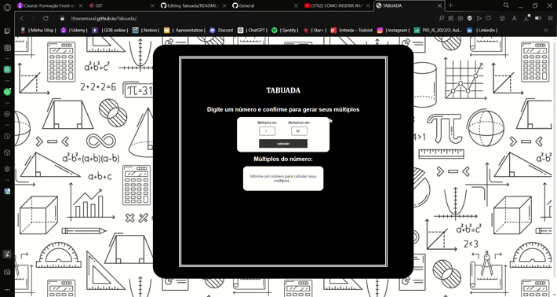

# Tabuada
Link do projeto ---> https://ithanamaral.github.io/Tabuada/
 
 
## Descrição
Primeiro site que fiz utilizando JavaScript afim de facilitar cálculos do dia a dia e contribuir com o aprendizado. Vale lembrar que a melhor visualização do projeto se encontra em um zoom aproximado de tela de 65% no navegador.
 
 

## GIF's
Aqui esta um gif do site desse projeto, para ver o video completo compactado vá na pasta Vídeos! =)
 

 
 

## About Me
Olá, meu nome é Íthan !

Esse é um dos vários projetos que tenho no meu GitHub. Eles são feitos para estudo e para montar meu portfólio de vagas na área de desenvolvimento (sendo este, voltado para Front-End). Pode ser um projeto simples, mas estou muito feliz por te-lô feito.
